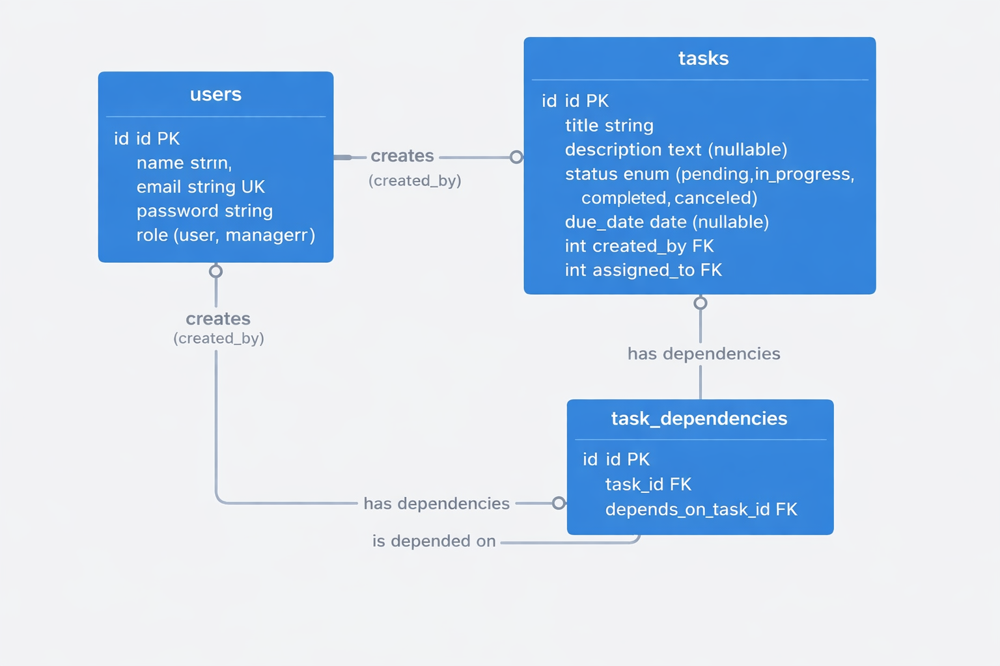

# Project ERD


## Prerequisites

- PHP 8.1+
- Composer
- MySQL/PostgreSQL
- Docker (optional)

## Installation
**Clone the repository**
```bash
   git clone 
   cd Management-system-Laravel
```
**Install dependencies**
```bash
   composer install
```
**Environment setup**
```bash
   cp .env.example .env
   php artisan key:generate
```
**Configure database**
   
   Edit `.env` file:
```
   DB_CONNECTION=mysql
   DB_HOST=127.0.0.1
   DB_PORT=3306
   DB_DATABASE=task_management
   DB_USERNAME=root
   DB_PASSWORD=
```
 **Run migrations and seeders**
```bash
   php artisan migrate --seed
```
 **Start the server**
```bash
   php artisan serve
```